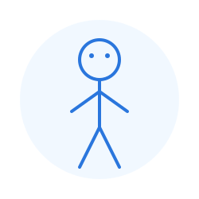

# Stick Figure Webcam 🎭

<div align="center">

*[Polska wersja (README.md)](README.md)*


[](https://github.com/psf/black)
[](https://pycqa.github.io/isort/)
[](http://mypy-lang.org/)



_**Be a stick figure in your next video conference!**_

</div>

## 📋 Project Overview

A Python application that captures your webcam feed, detects your pose in real-time, and transforms you into an animated
stick figure on a white background. The app automatically detects whether you're sitting or standing and adjusts the
animation accordingly. The generated image is available as a virtual camera source, which you can use in applications
like Discord, Zoom, Teams, or other video conferencing tools.

### ✨ Key Features

- 🕺 Real-time human pose detection
- 🪑 Automatic sitting/standing position detection
- 🖌️ Stick figure rendering that mirrors your movements
- 🎥 Virtual camera output for video applications
- 🚀 Low CPU and bandwidth requirements

## 🎯 Project Goals

- Create an anonymous alternative for participating in video conferences
- Reduce internet bandwidth requirements
- Add a fun element to video conferences
- Practical application of human pose detection and real-time image processing

## 🖥️ System Requirements

### Software Requirements

- Python 3.8 or newer (3.10 recommended)
- Libraries: OpenCV, MediaPipe, NumPy, PyVirtualCam
- Access to a webcam

### Supported Operating Systems

- **Windows**: Requires OBS Virtual Camera or similar
- **macOS**: Requires OBS Virtual Camera + appropriate plugin
- **Linux**: Requires v4l2loopback module

## 🔧 Installation

1. Clone the repository:
    ```bash
    git clone https://github.com/philornot/StickfigureWebcam.git
    cd StickfigureWebcam
    ```

2. Create and activate a virtual environment (optional but recommended):
    ```bash
    python -m venv venv

    # Windows:
    venv\Scripts\activate

    # Linux/macOS:
    source venv/bin/activate
    ```

3. Install required libraries:
    ```bash
    # For users: install just the application
    pip install -e .

    # For developers: install with development tools
    pip install -e ".[dev]"
    ```

4. Install additional software:
    - **Windows**: Install [OBS Studio](https://obsproject.com/) and start Virtual Camera
    - **macOS**: Install [OBS Studio](https://obsproject.com/)
      and [OBS Virtual Camera Plugin](https://github.com/johnboiles/obs-mac-virtualcam)
    - **Linux**: Install v4l2loopback:
      ```bash
      sudo apt-get install v4l2loopback-dkms
      sudo modprobe v4l2loopback
      ```

## 🚀 Usage

### Running the Application

```bash
# Using the Python module
python -m src.main

# Using make (if you have Make installed)
make run

# With command-line options
python src/main.py --width 640 --height 480 --fps 30 --debug
```

The application will start, activate your webcam, and begin pose detection. In video conferencing applications (Discord,
Zoom, Teams), select "Stick Figure Webcam" as your video source.

### Keyboard Controls

| Key          | Action                   |
|--------------|--------------------------|
| `q` or `ESC` | Exit application         |
| `p`          | Pause/resume processing  |
| `d`          | Toggle debug mode        |
| `f`          | Toggle horizontal flip   |
| `t`          | Send test pattern        |
| `r`          | Reset virtual camera     |
| `l`          | Toggle adaptive lighting |

### Development Commands

```bash
# Run tests
make test
python -m pytest

# Check code style
make lint

# Type checking
make type-check

# Format code
make format

# Set up development environment
make dev-setup
```

## 📁 Project Structure

```
StickfigureWebcam/
├── src/                  # Source code
│   ├── camera/           # Camera capture and virtual camera
│   ├── config/           # Application settings
│   ├── drawing/          # Stick figure rendering
│   ├── lighting/         # Adaptive lighting
│   ├── pose/             # Pose detection and analysis
│   └── utils/            # Utility functions
├── tests/                # Unit tests
├── pyproject.toml        # Project configuration
├── requirements.txt      # Runtime dependencies
├── requirements-dev.txt  # Development dependencies
└── Makefile              # Development tasks
```

## 🛠️ Configuration Files

The project includes several configuration files for modern Python development:

- **pyproject.toml**: Main project configuration (metadata, dependencies, tool settings)
- **tox.ini**: Multi-environment testing configuration
- **.pre-commit-config.yaml**: Git hooks for code quality
- **mypy.ini**: Type checking configuration
- **.flake8**: Code style checking rules
- **.editorconfig**: Editor-agnostic code style settings
- **Makefile**: Convenient development commands

## 🔍 Troubleshooting

- **Problem**: Pose not detected correctly
    - **Solution**: Ensure you're well-lit and visible in the camera frame

- **Problem**: Virtual camera not visible in applications
    - **Solution**: Verify that OBS Virtual Camera is running or that v4l2loopback is properly loaded

- **Problem**: Application runs slowly
    - **Solution**: Reduce camera resolution in settings or lower target FPS

## 🧩 Future Extensions

Possible enhancements for the project:

1. **Facial expressions** - emotion detection and animation
2. **Appearance customization** - changeable stick figure style
3. **Gesture detection** - special gesture recognition (waving, thumbs up)
4. **Motion smoothing** - reduce jitter in stick figure movements
5. **Backgrounds and props** - add interactive environment elements

## 📄 License

This project is licensed under the [MIT License](LICENSE).

## 👤 Author

philornot
